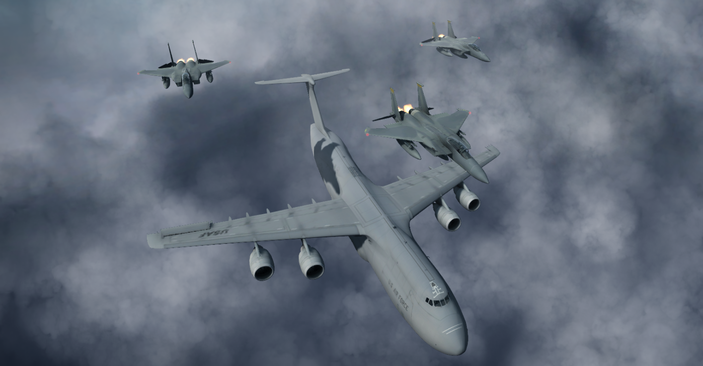
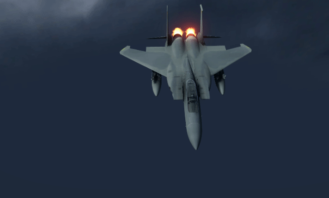
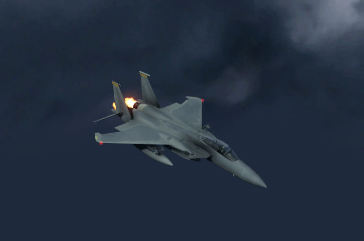
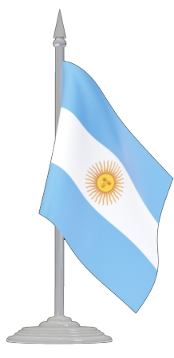

#  Computer Graphics - Final Project

Models by <a href="https://free3d.com/user/jasonowen">Jason Ohonowskyj</a>

Final assignment for the Computer Graphics course, at **Universidad Nacional del Sur**.

Model disassembly, implemented in Unity.

### Team
* Castro Martin
* Corpaz German
* Frank Andres
* Salazar Gabriel

### How to run

1. Head over to the <a href="https://github.com/andres-frank/uns-cg-finalproject/tree/master/Builds">builds folder</a> and download the appropriate file for your system
2. Fully unzip it (Don't try to run it from inside the compressed file!)
3. Run the executable.

### Functionality
* Full model disassembly.
* Spherical camera that orbits around the selected object.
* Simulation of fire, air, and clouds via particle systems.
* Animated GUI.
* Piece selection via clicking with shader highlighting for feedback.
* Ambient and action sounds.

### Sources and Acknowledgements
* Big thanks to <a href="https://free3d.com/user/jasonowen">Jason Ohonowskyj</a> for his great models.
* Skybox by <a href="http://www.custommapmakers.org/skyboxes.php">Custom Map Makers</a>.
* <a href="https://www.youtube.com/user/Brackeys">Brackey's YouTube channel</a> for high quality Unity tutorials.
* Object highlighting by the great Dan Moran ([YouTube](https://www.youtube.com/watch?v=SMLbbi8oaO8) | [GitHub](https://github.com/Broxxar/GlowingObjectOutlines))

 
 

