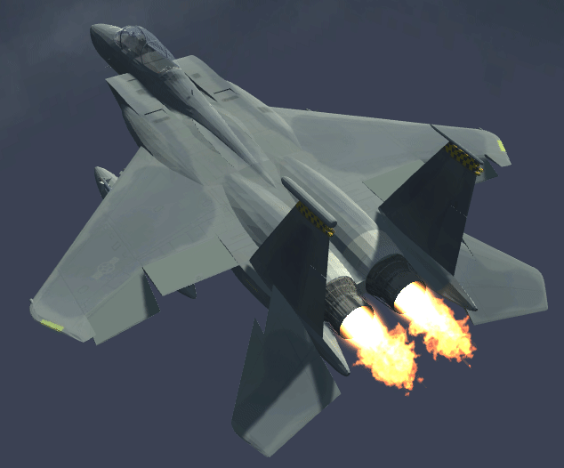

#  Computer Graphics - Final Project

Models by <a href="https://free3d.com/user/jasonowen">Jason Ohonowskyj</a>            

Final assignment for the Computer Graphics course, at **Universidad Nacional del Sur**.

Model disassembly, implemented in Unity.

### Team
* Castro Martin
* Corpaz German
* Frank Andres
* Salazar Gabriel

### How to run

1. Head over to the  and download the appropriate file for your system
2. Fully unzip it (Don't try to run it from inside the compressed file!)
3. Run the executable.

### Functionality
* Spherical camera that orbits around the selected object.
* Simulation of fire, air, and clouds via particle systems.
* Animated GUI.
* Piece selection via clicking with shader highlighting for feedback.
* Ambient and action sounds.

### Sources
* Big thanks to <a href="https://free3d.com/user/jasonowen">Jason Ohonowskyj</a> for his great models.
* Skybox by <a href="http://www.custommapmakers.org/skyboxes.php">Custom Map Makers</a>.
* <a href="https://www.youtube.com/user/Brackeys">Brackey's YouTube channel</a> for high quality Unity tutorials.

 
 

