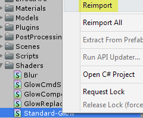

## Unity Project

This project was performed on [Unity](https://unity3d.com/get-unity/download) version 2018.1.1f1.

We used the plugin [GitHub for Unity](https://unity.github.com/) version 1.0.0rc4 Beta.

---
### How to open

Simply run Unity, choose 'Open..' and in the dialog select this folder (the one named 'Unity Project').
After Unity compiles all scripts and opens up, navigate to the Scenes folder and open the MainScene.

---
### Shader Error on startup

If you get this error when you open the project:
```
Shader error in 'StandardGlow': invalid subscript 'uv2' at /Program Files/Unity/Editor/Data/CGIncludes/UnityStandardMeta.cginc(21) (on d3d11)

Compiling Vertex program
Platform defines: UNITY_ENABLE_REFLECTION_BUFFERS UNITY_USE_DITHER_MASK_FOR_ALPHABLENDED_SHADOWS UNITY_PBS_USE_BRDF1 UNITY_SPECCUBE_BOX_PROJECTION UNITY_SPECCUBE_BLENDING UNITY_ENABLE_DETAIL_NORMALMAP SHADER_API_DESKTOP UNITY_COLORSPACE_GAMMA UNITY_LIGHT_PROBE_PROXY_VOLUME UNITY_LIGHTMAP_FULL_HDR
```

Right click the 'Standard-Glow' file in the Shaders folder and choose 'Reimport'. That should permanently fix the problem.

